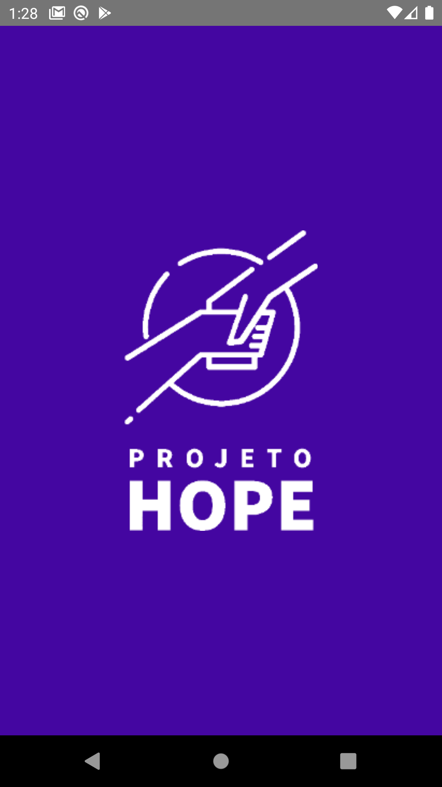

# hope
Desafio de programação LAVID/FUZE.cc SELEÇÃO BOLSISTAS 2021;

# Features

* Serviço de administração (CRUD) de usuários e conteúdos digitais (cards); :x:
* Serviço de autenticação utilizando tokens (*Por enquanto sem a funcionalidade de "Esqueci a senha"*); :white_check_mark:
* Serviço de notificação de mensagens de envio para o dispositivo a partir do administrador do aplicativo; :x:
* Serviço de comunicação síncrona (chats) entre usuários (por cadastro ou id do dispositivo); :x:

# Screencast

*Em produção*

# Screenshots

*Em produção*

* Splashscreen

 

* Animation

